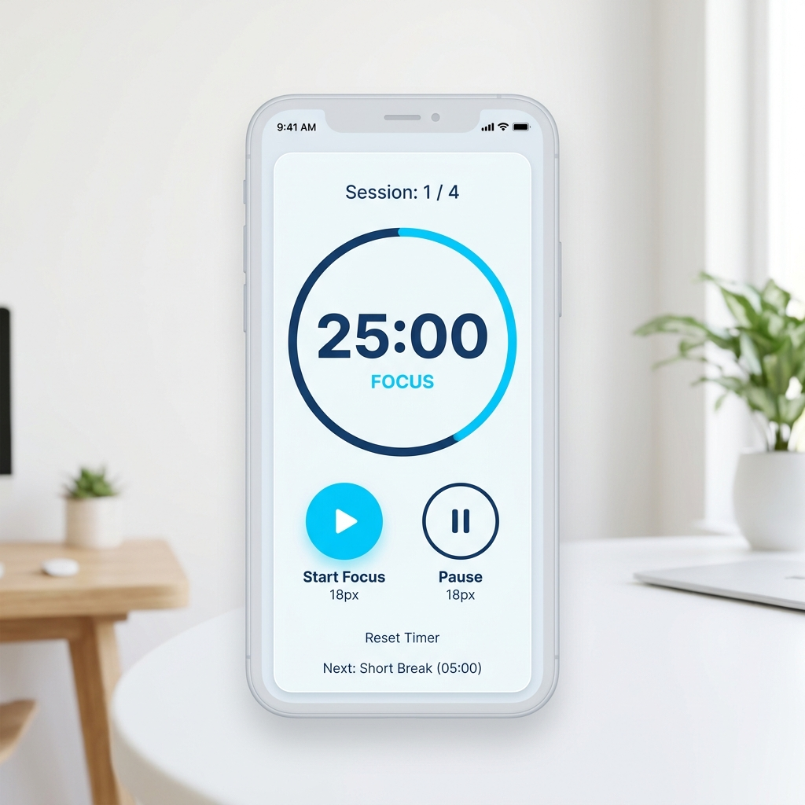

# ✈️ Study with me

> **몰입을 위한 나만의 온라인 스터디룸**
> 집에서도 카페, 자연, 그리고 비행기 안에서 공부하는 듯한 생생한 몰입감을 경험하세요.



## 📌 프로젝트 소개
**'Study with me'**는 웹 기반의 가상 스터디룸 플랫폼입니다.
단순한 화상 채팅을 넘어, 백색소음 ASMR 테마, 뽀모도로 타이머, 투두 리스트 등 학습의 효율을 극대화할 수 있는 다양한 도구를 제공합니다. 
특히 **비행기 탑승 모드**를 통해 진짜 비행기 창밖 풍경을 보며 목적지까지의 비행 시간을 공부 시간으로 활용하는 색다른 경험을 즐길 수 있습니다.

---

## 🚀 주요 기능 (Features)

### 1. 다양한 테마의 스터디룸 🎧
- **ASMR 영상 테마:** 파도 소리, 타닥타닥 벽난로, 비 내리는 창가 등 집중력을 높여주는 영상과 소리가 제공됩니다.
- **공개/비밀방 개설:** 누구나 들어올 수 있는 공개방 또는 참여 코드로 지인들만 초대할 수 있는 비밀방을 개설할 수 있습니다.

### 2. 비행기 탑승 스터디 모드 ✈️
- **기내 좌석 선택 (Cabin UI):** First Class, Business Class, Economy Class 중 원하는 좌석을 선택하여 스터디에 참여합니다.
- **목적지 비행 타이머:** 제주도(1시간), 도쿄(2시간), 파리(12시간) 등 목적지를 선택하면, 해당 비행 시간이 스터디 타이머로 작동합니다.
- **창문 프레임 오버레이:** 스터디룸 화면에 실제 비행기 창문이 씌워져 창밖 풍경을 감상하며 몰입할 수 있습니다. 비행이 끝나면 도착 알림이 나타납니다.

### 3. 학습 능률 도구 (Study Toolbox) 🛠️
- **뽀모도로 타이머:** 25분 집중, 5분 휴식 사이클을 통해 효율적으로 학습 시간을 관리하세요. 누적 공부 시간도 실시간으로 체크할 수 있습니다.
- **투두 리스트 (To-Do):** 그날의 목표를 추가하고 삭제하며, 프로그레스 바를 통해 달성률을 한눈에 파악할 수 있습니다.
- **실시간 채팅:** Supabase Realtime을 활용하여 같은 방에 있는 스터디원들과 실시간으로 소통할 수 있습니다.

### 4. 나의 누적 집중 시간 📈
- 대시보드에서 본인이 지금까지 'Study with me'에서 학습한 총 누적 시간을 직관적으로 확인할 수 있습니다.

---

## 💻 기술 스택 (Tech Stack)
- **Frontend:** HTML5, Vanilla CSS, JavaScript (ES6+)
- **Backend (BaaS):** Supabase (Authentication, Database, Realtime)
- **Design:** Modern CSS (Flexbox/Grid), Glassmorphism UI, Responsive Web

---

## 🛠️ 실행 방법 (Getting Started)

1. **저장소 클론하기**
   ```bash
   git clone https://github.com/Aso-n07/My-Web-site.git
   cd My-Web-site
   ```

2. **로컬 서버 실행**
   VS Code의 `Live Server` 익스텐션을 사용하거나, 파이썬을 이용해 간단히 실행할 수 있습니다.
   ```bash
   # Node.js가 설치되어 있는 경우
   npx serve -p 3000

   # Python이 설치되어 있는 경우
   python -m http.server 3000
   ```

3. **브라우저 접속**
   브라우저에서 `https://aso-n07.github.io/My-Web-site/` 으로 접속하여 서비스를 이용합니다.

---

## 📝 라이선스 (License)
이 프로젝트는 개인 포트폴리오 및 토이 프로젝트 용도로 제작되었습니다.
